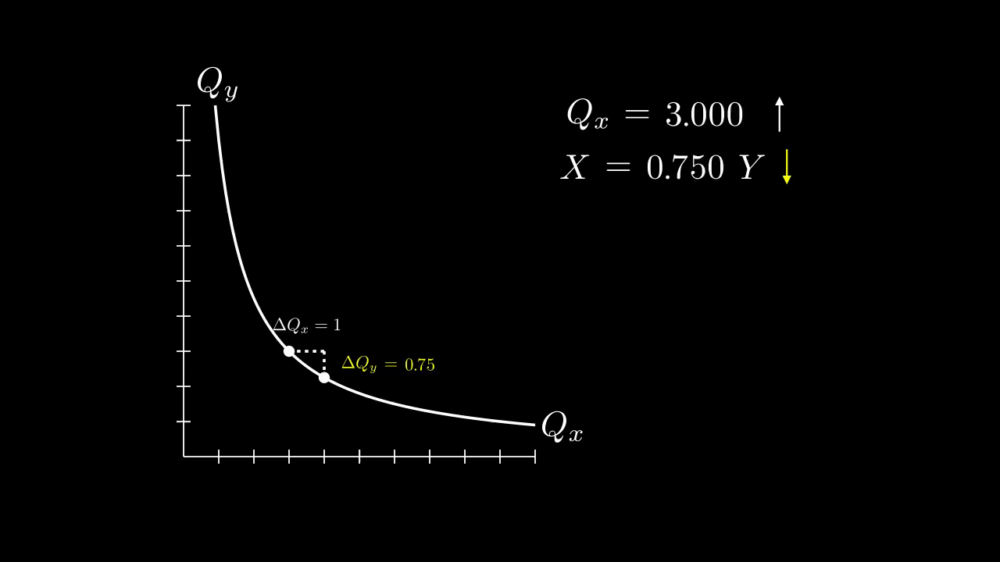

# Economics related animations for teenage students

Made with [ManimCE](https://docs.manim.community/en/stable/index.html#)

## Budget Constraint

|                                                                                                                                                                   |                                                               |
| ----------------------------------------------------------------------------------------------------------------------------------------------------------------- | ------------------------------------------------------------- |
| #1: budget constraint changing in response to price change of good x (Px)                                                                                         |  |
| #2: consumption bundle with fixed consumption of good y (Qy=2) changing as budget changes (showing that Qx increases when Px decreases; lower price = more goods) |  |

## Indifference Curve

|                                                                                                                                                                          |                                                                                                                         |
| ------------------------------------------------------------------------------------------------------------------------------------------------------------------------ | ----------------------------------------------------------------------------------------------------------------------- |
| #1: dot moving along a fixed indifference curve                                                                                                                          |  |
| #2: dot moving with a moving indifference curve                                                                                                                          |  |
| #3: comparing bundles on indifference curve (Illustraiting diminishing marginal rate of substitution)                                                                    |                                                          |
| #4: comparing how much of good Y would one trade for a unit of good X on each point on the indifference curve. (Illustraiting diminishing marginal rate of substitution) |  |
| #5: deriving MRS formulas; MRS changing with Qx                                                                                                                          |                                                          |
| #6: showing corresponding budget constraint                                                                                                                              |                                                          |

## Deriving the Demand Curve

|                                                                                                                                                                   |                                                       |
| ----------------------------------------------------------------------------------------------------------------------------------------------------------------- | ----------------------------------------------------- |
| #1: Budget constraint and highest indifference curve changing in response to changes in price of good x (px); plot derived demand curve on a Price-Quantity plane |  |

## Expected Utility Theory

|     |     |
| --- | --- |
|     |     |
