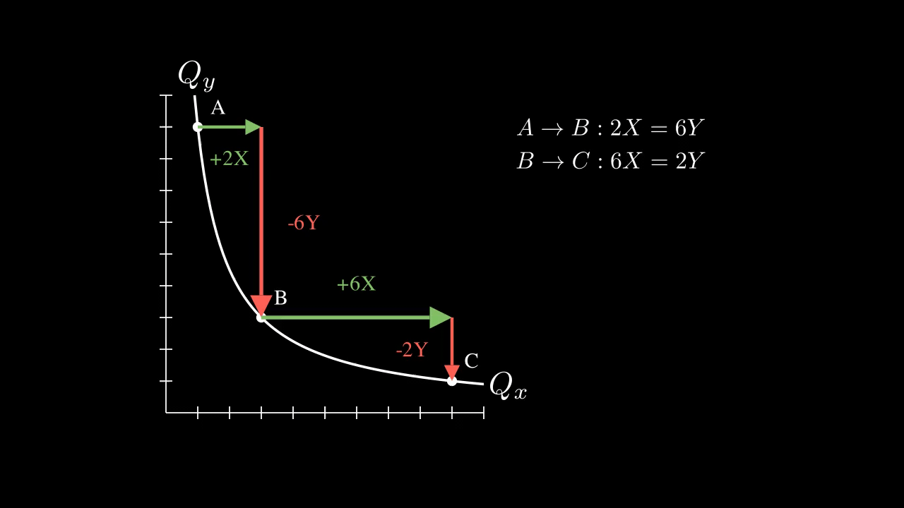

# Economics related animations for teenage students

Made with [ManimCE](https://docs.manim.community/en/stable/index.html#)

## Budget Constraint

Animation #1: budget constraint changing in response to price change of good x (Px)

Animation #2: consumption bundle with fixed consumption of good y (Qy=2) changing as budget changes (showing that Qx increases when Px decreases; lower price = more goods)

## Indifference Curve

Animation #1: dot moving along a fixed indifference curve
    

Animation #2: dot moving with a moving indifference curve

Animation #3: comparing bundles on indifference curve (Illustraiting diminishing utility of good x (as measured by how much y to which it's equivalent))

Animation #4: comparing how much of good Y would one trade for a unit of good X on each point on the indifference curve. (Illustraiting diminishing utility of good x, like #3)

Animation #5: deriving MRS formulas; MRS changing with Qx

## Deriving the Demand Curve

Budget constraint and highest indifference curve changing in response to changes in price of good x (px); plot derived demand curve on a Price-Quantity plane 

