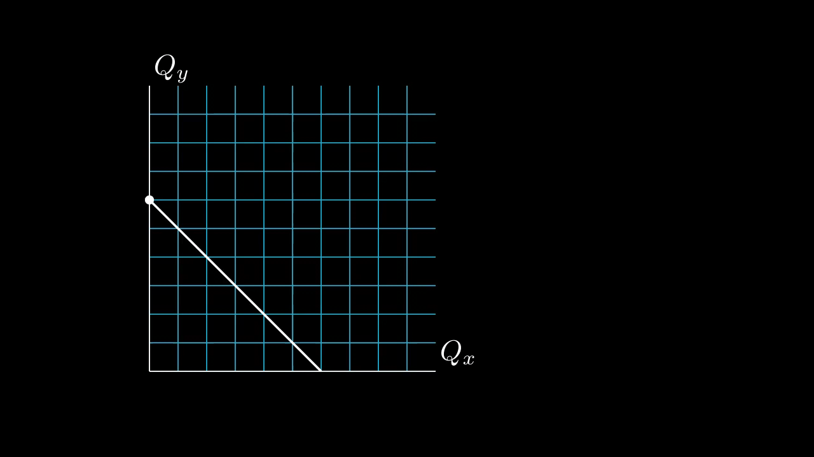
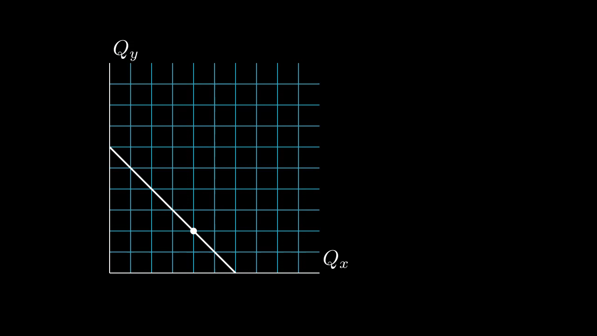
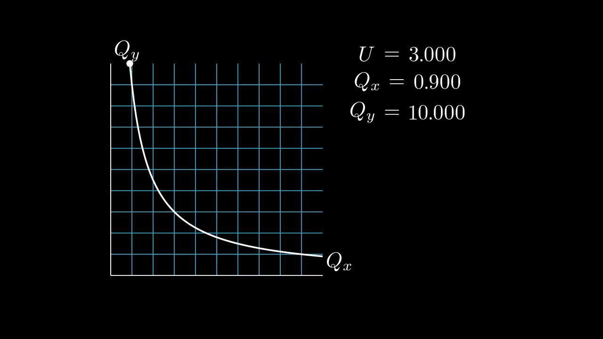
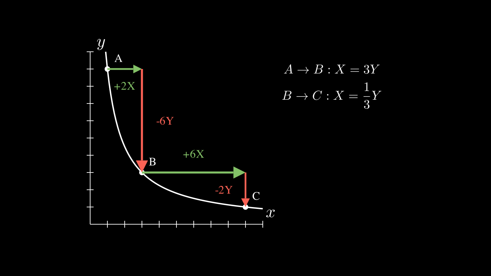
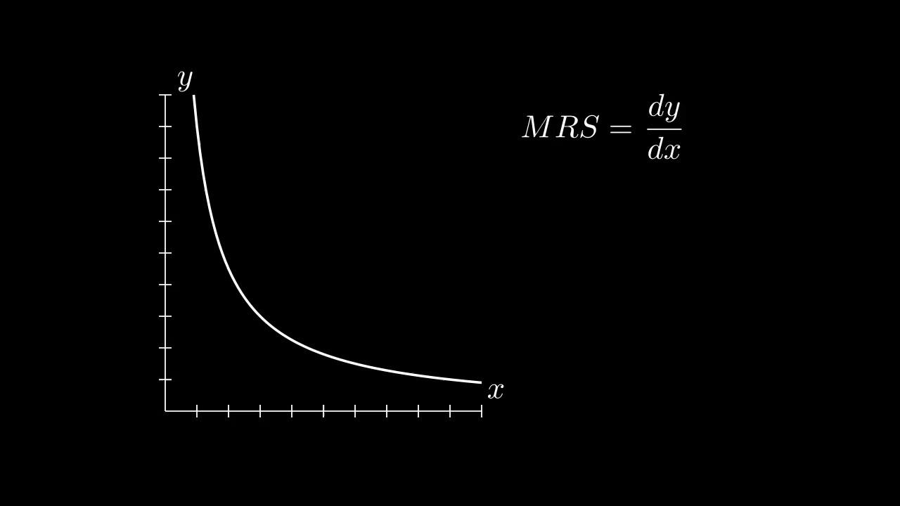

## Budget Constraint

|                                                                                                                                                                   |                                                           |
| ----------------------------------------------------------------------------------------------------------------------------------------------------------------- | --------------------------------------------------------- |
| #1: budget constraint changing in response to price change of good x (Px)                                                                                         |  |
| #2: consumption bundle with fixed consumption of good y (Qy=2) changing as budget changes (showing that Qx increases when Px decreases; lower price = more goods) |  |

## Indifference Curve

|                                                                                                                                                                          |                                                                |
| ------------------------------------------------------------------------------------------------------------------------------------------------------------------------ | -------------------------------------------------------------- |
| #1: dot moving along a fixed indifference curve                                                                                                                          |      |
| #2: dot moving with a moving indifference curve                                                                                                                          |      |
| #3: comparing bundles on indifference curve (Illustraiting diminishing marginal rate of substitution)                                                                    |     |
| #4: comparing how much of good Y would one trade for a unit of good X on each point on the indifference curve. (Illustraiting diminishing marginal rate of substitution) |  |
| #5: deriving MRS formulas; MRS changing with Qx                                                                                                                          |     |
| #6: showing corresponding budget constraint                                                                                                                              |     |
