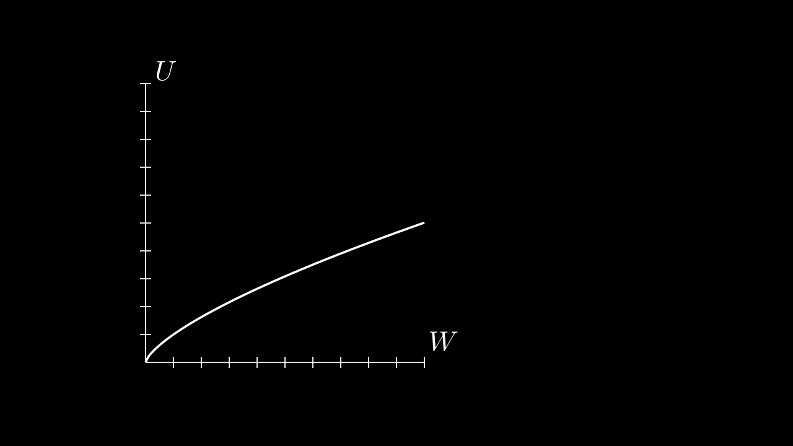
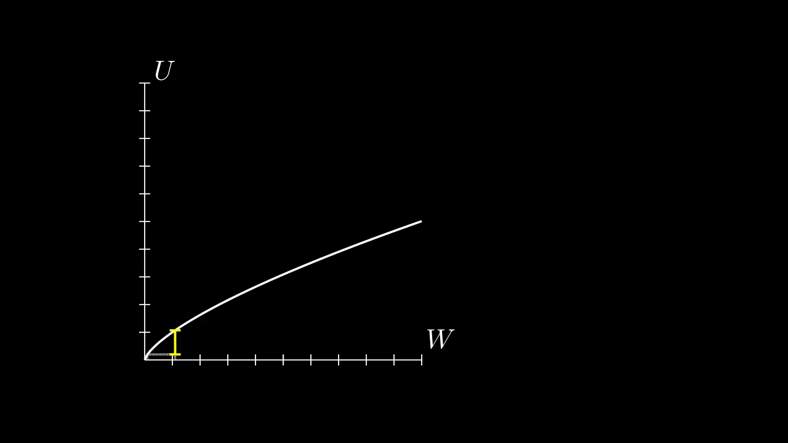
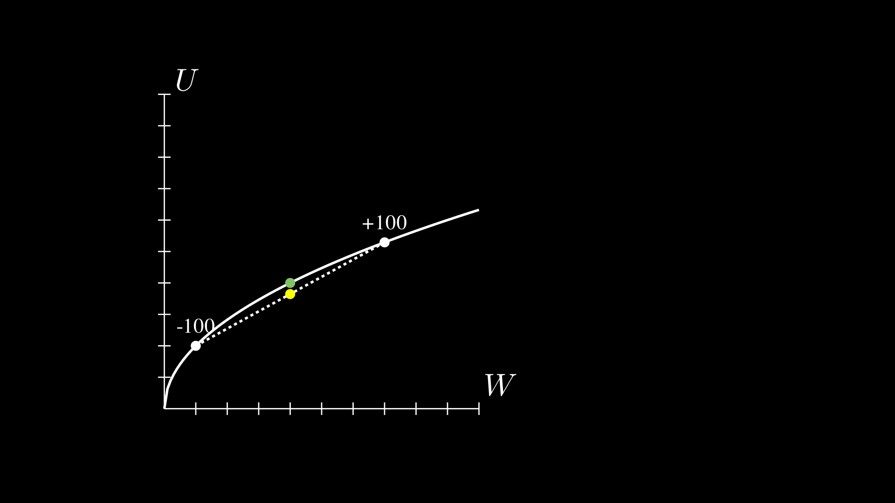
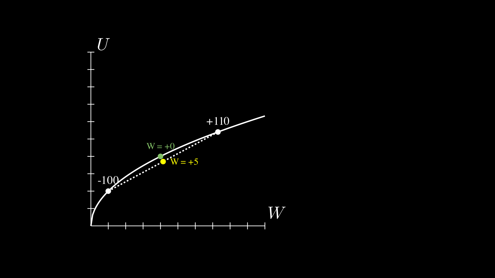
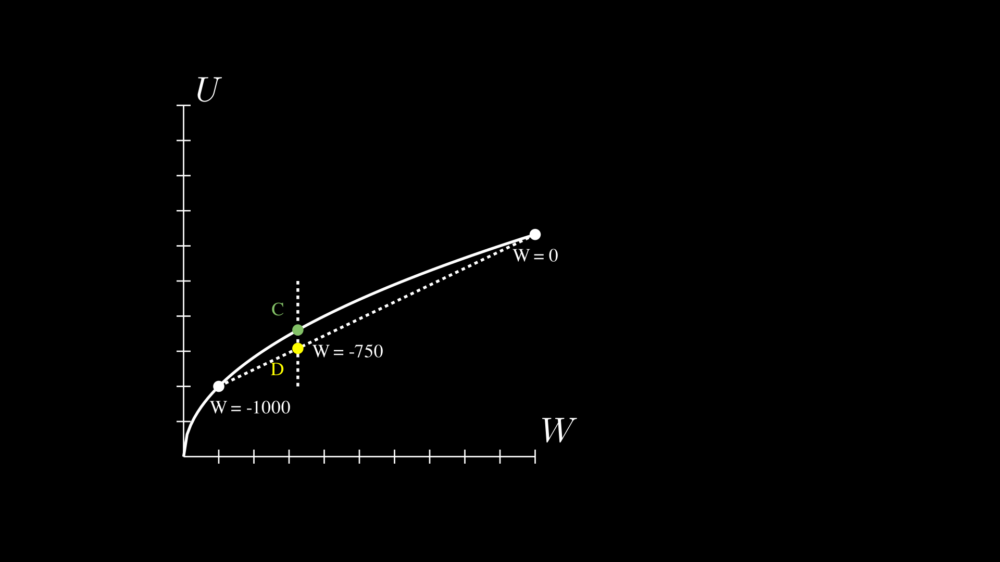

## Expected Utility Theory

Animation \#0: showing u(w)

Animation \#1: diminishing marginal utility of wealth showing utility change for [w, w+1] (w = w_tracker)

Animation \#2: showing expected utility for bet: 50% +100; 50% -100

Animation \#3: showing expected utility for bet: 50% +110; 50% -100

Animation \#4: showing expected utility for choices: 100% -750 or 75% -1000

